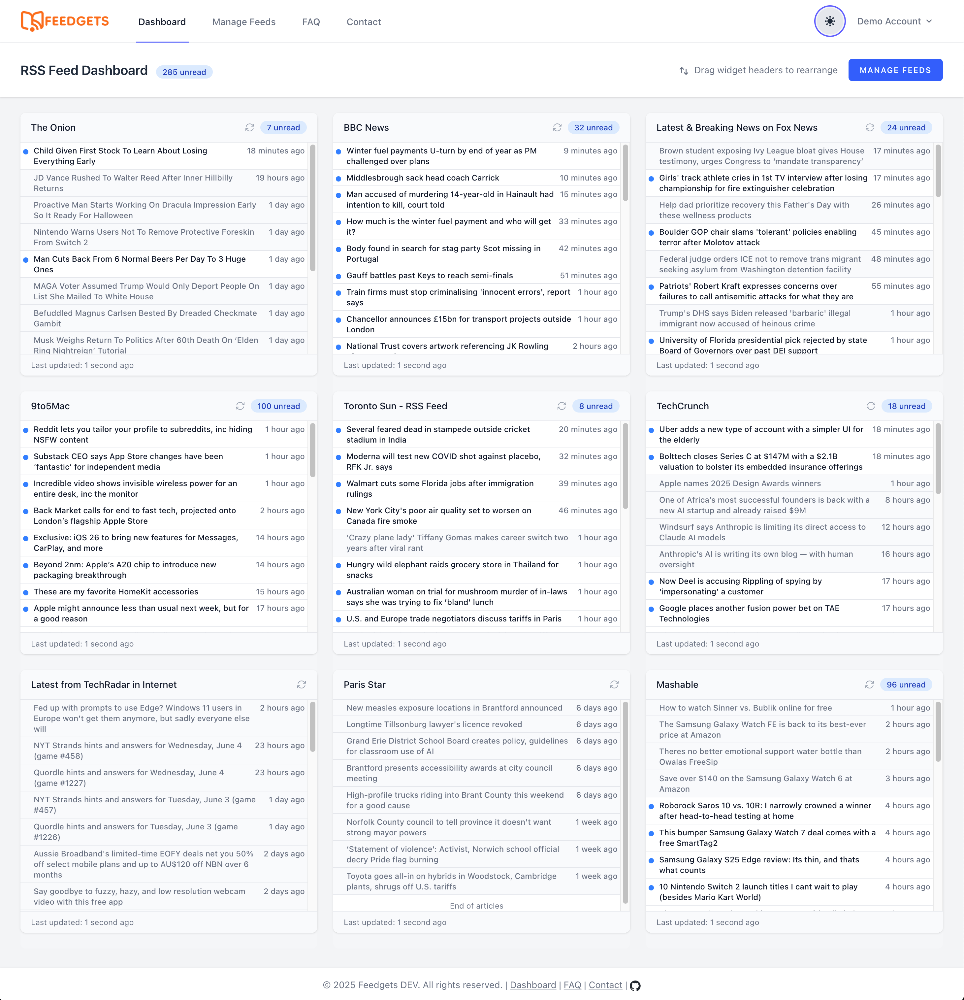
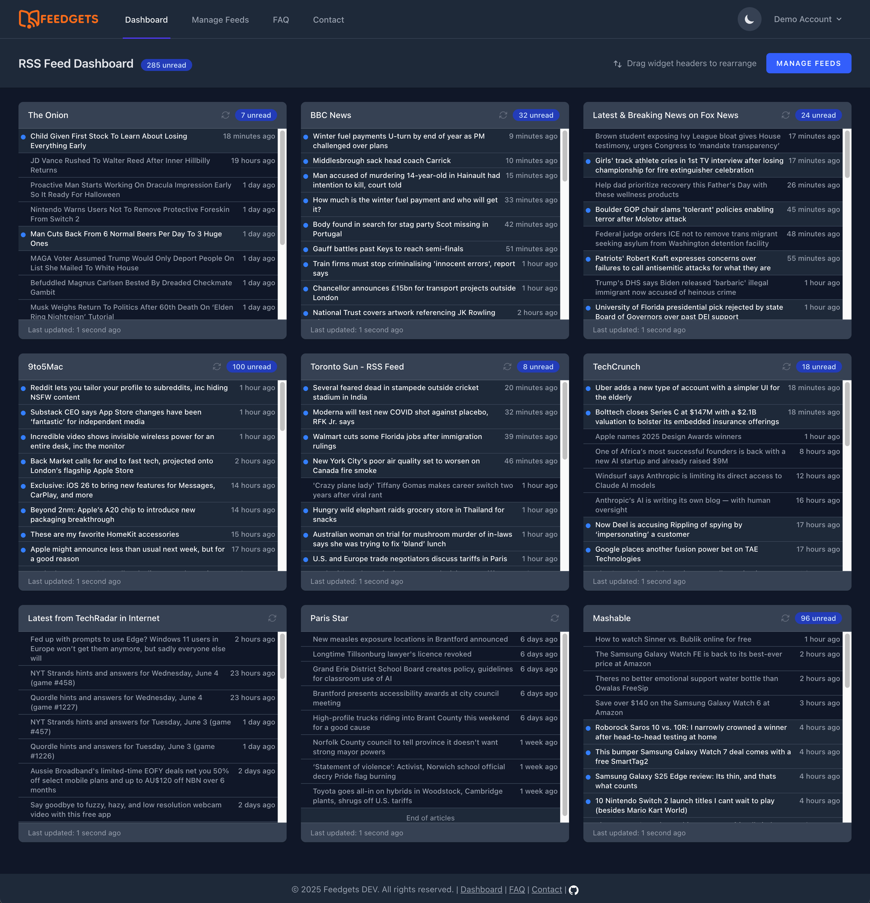

# Feedgets

**Feedgets** is a modern, open-source dashboard built as a response to the shutdown of **Netvibes**. Like many, I relied on Netvibes to organize feeds and widgets in one customizable place — but when it announced its shutdown, I couldn't find a suitable replacement. So I built one.

This project is not just a replacement — it's also an AI experiment and playground for me. Wherever possible, I tried to use AI tools and prompt engineering to assist in generating code and tests, scaffolding features, and improving developer workflows.

Feedgets is powered by the TALL stack – install it as a regular Laravel project. Cloudflare's Turnstile is used as a Captcha service.

Contributions are welcome, and feel free to explore how AI can be integrated into modern open-source development.

Some features that are yet to be implemented:
- Caching
- Optimizing Livewire components to work with less data per request
- Replace widget polling with event listeners

## Screenshots

### Light theme


### Dark theme


## API

Feedgets ships a versioned JSON API (`/api/v1`) usable by the web app and third-party
clients. Authentication uses [Laravel Sanctum](https://laravel.com/docs/sanctum) personal
access tokens.

Interactive, always-up-to-date documentation is generated from the code with
[Scramble](https://scramble.dedoc.co/) and served at **`/docs/api`** (OpenAPI 3.1 JSON at
`/docs/api.json`). Run `php artisan scramble:export` to write the spec to a file for CI or
to import into Postman/Insomnia.

### Authentication

Create a token via **Settings → API Tokens** in the UI, or programmatically:

```bash
# Register and receive a token
curl -X POST https://your-host/api/v1/auth/register \
  -H "Accept: application/json" \
  -d "name=Ada" -d "email=ada@example.com" \
  -d "password=secret1234" -d "password_confirmation=secret1234"

# Or log in for an existing account
curl -X POST https://your-host/api/v1/auth/login \
  -H "Accept: application/json" \
  -d "email=ada@example.com" -d "password=secret1234"
```

Both return `{ "token": "...", "user": { ... } }`. Send the token on every authenticated
request:

```bash
curl https://your-host/api/v1/feeds \
  -H "Accept: application/json" \
  -H "Authorization: Bearer <token>"
```

`register` and `login` are rate-limited to 6 requests/minute. Call `POST /api/v1/auth/logout`
to revoke the token used for the request.

### Endpoints

All routes below require `Authorization: Bearer <token>` and are prefixed with `/api/v1`.

| Method | Path | Description |
| --- | --- | --- |
| `POST` | `/auth/register` | Register, returns a token |
| `POST` | `/auth/login` | Log in, returns a token |
| `GET` | `/auth/me` | The authenticated user |
| `POST` | `/auth/logout` | Revoke the current token |
| `GET` | `/feeds` | List your feeds (with `unread_count`) |
| `POST` | `/feeds` | Create a feed (`url` required; `title` auto-extracted when blank) |
| `GET` | `/feeds/{feed}` | Show a feed |
| `PUT/PATCH` | `/feeds/{feed}` | Update a feed |
| `DELETE` | `/feeds/{feed}` | Delete a feed |
| `POST` | `/feeds/{feed}/reorder` | Move a feed (`column` 0–2, `index`) |
| `GET` | `/feeds/{feed}/articles` | Articles for a feed |
| `POST` | `/feeds/{feed}/mark-all-read` | Mark read (optional `published_at` cutoff) |
| `GET` | `/articles` | Articles across all your feeds |
| `GET` | `/articles/{article}` | Show an article |
| `POST` | `/articles/{article}/mark-read` | Mark one article read |
| `POST` | `/opml/import` | Import feeds from an OPML file (`file`) |
| `GET` | `/opml/export` | Export your feeds as OPML |

Feeds and articles are identified by `uuid`. Article listings are paginated
(`?per_page=` up to 100, `?unread=1` to filter), returning standard Laravel
`data` / `links` / `meta` envelopes.

A future `v2` lives under `/api/v2` alongside `v1`; existing `v1` clients are unaffected.